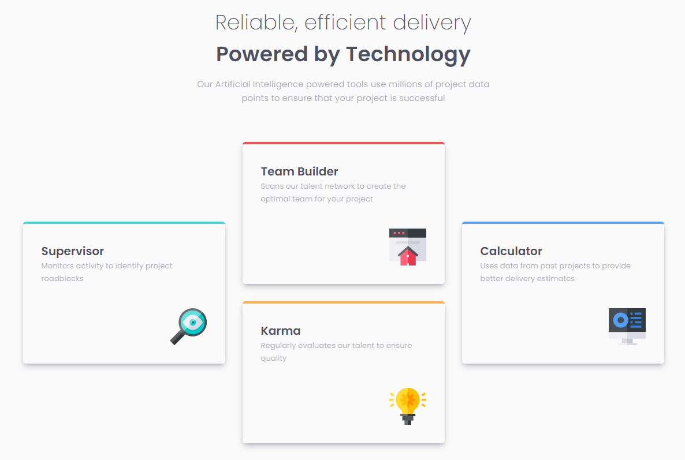

# Frontend Mentor - Four card feature section solution

This is a solution to the [Four card feature section challenge on Frontend Mentor](https://www.frontendmentor.io/challenges/four-card-feature-section-weK1eFYK). Frontend Mentor challenges help you improve your coding skills by building realistic projects.

## Overview

### The challenge

Users should be able to:

- View the optimal layout for the site depending on their device's screen size

### Screenshot

## My process

### Built with

- Semantic HTML5 markup
- CSS custom properties
- Flexbox
- CSS Grid

### What I learned

- With uneven rows it's best to stick with grid and format the html accordingly. Even though my approach of having 1 row and 3 columns with 3 grid child elements worked, I couldn't achieve a 2x2 layout for tablet view because of the second child div inside the grid defining the height of the row. This left what seemed like an "empty gap."

### Continued development

- A more nuanced understanding of css grid.

## Author

- Frontend Mentor - [@dagimchi](https://www.frontendmentor.io/profile/dagimchi)
- Twitter - [@dagimchi](https://www.twitter.com/dagimchi)
